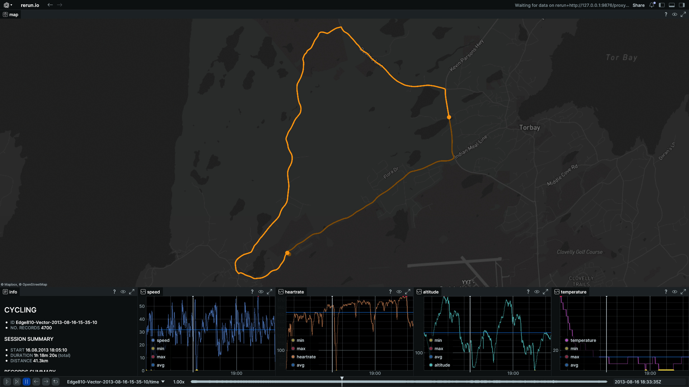
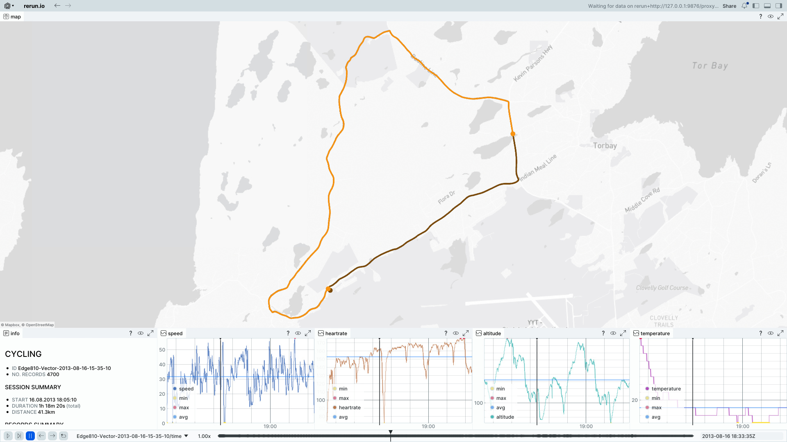

# fit-activities-rerun

Load [`*.fit` file](https://developer.garmin.com/fit/overview/) data and stream it into [Rerun.io](https://rerun.io) for interactive visualization of fitness activities.

**Features:**

- Map views: [`OpenStreetMap`](https://www.openstreetmap.org) (default) or [`Mapbox`](https://www.mapbox.com) ([access token](https://docs.mapbox.com/help/glossary/access-token/) required)
- Charts: `speed`, `heart rate`, `altitude`, `temperature`
- `Summary` info panel
- Build in `Rust` or `Python`
- Free and open source

<details>
<summary>Table of Contents</summary>

- [Preview](#preview)
- [Requirements](#requirements)
- [Usage](#usage)
- [CLI](#cli)
- [License](#license)

</details>

# Preview

## Dark theme

<a href="data/far-dark.jpg">
  
</a>

## Light theme

<a href="data/far-light.jpg">
  
</a>

# Requirements

## With `Nix` (recommended)

`cd` into root directory. If you have `direnv` installed, run `direnv allow` once to install dependencies. Otherwise run `nix develop`. This will set up `Rust`, `Python`, `uv` and all system dependencies you need.

## Without `Nix`

You can use either `Python` or `Rust` to run `fit-activities-rerun`:

### Python

- [Python](https://www.python.org) 3.13+
- [uv](https://docs.astral.sh/uv/)

Setup `uv`:

```sh
uv venv .venv
source .venv/bin/activate
uv sync
```

### Rust

- [Rust](https://rust-lang.org/)

### Rerun

Rerun viewer is needed to run `fit-activities-rerun`.

By following instructions above to setup Python and `uv`, the `rerun-sdk` package is already installed. It provides a CLI to the needed Rerun viewer.

You might want to double check it. On Linux as follow:
```sh
which rerun
{path-to}/fit-activities-rerun/.venv/bin/rerun
```

To update `rerun-sdk` package to another version, open `pyproject.toml` and change the version constraint for `rerun-sdk`. Run `uv sync` again. 

If you don't use Python, you can install the Rust [`rerun` crate](https://crates.io/crates/rerun) to get a CLI to the Rerun viewer.

Note: You never run Rerun's CLI by yourself, all is done "behind the scenes" by running `fit-activities-rerun` command only (see next chapter "Usage").

# Usage

### Python

```sh
fit-activities-rerun --fit <path-to-fit-file>
```

### Rust

```sh
cargo run -- --fit <path-to-fit-file>
```

# CLI

## Python

```sh
fit-activities-rerun --help
```

<details>
<summary>Output</summary>

```sh
usage: fit-activities-rerun [-h] --fit FIT [--blueprint {none,vertical}] [--map {osm,dark,light,streets,satellite}] [--headless] [--connect] [--serve] [--url URL] [--save SAVE] [--stdout]

Visualize `*.fit` data using Rerun.

options:
  -h, --help            show this help message and exit
  --fit FIT             Path to the .fit file. (required)
  --blueprint {none,vertical}
                        Blueprint to use. (default: vertical)
  --map {osm,dark,light,streets,satellite}
                        Map tile style. To use styles other than 'osm', set the environment variable RERUN_MAPBOX_ACCESS_TOKEN. (default: osm)
  --headless            Don't show GUI
  --connect             Connect to an external viewer
  --serve               Serve a web viewer (WARNING: experimental feature)
  --url URL             Connect to this Rerun URL
  --save SAVE           Save data to a .rrd file at this path
  --stdout              Log data to standard output, to be piped into a Rerun Viewer
```

</details>

## Rust

```sh
cargo run -- --help
```

<details>
<summary>Output</summary>

```sh
Usage: fit-activities-rerun [OPTIONS] --fit <FILE>

Options:
      --spawn
          Start a new Rerun Viewer process and feed it data in real-time

      --save <SAVE>
          Saves the data to an rrd file rather than visualizing it immediately

  -o, --stdout
          Log data to standard output, to be piped into a Rerun Viewer

      --connect [<CONNECT>]
          Connects and sends the logged data to a remote Rerun viewer.

          Optionally takes a URL to connect to.

          The scheme must be one of `rerun://`, `rerun+http://`, or `rerun+https://`, and the pathname must be `/proxy`.

          The default is `rerun+http://127.0.0.1:9876/proxy`.

      --server-memory-limit <SERVER_MEMORY_LIMIT>
          An upper limit on how much memory the gRPC server should use.

          The server buffers log messages for the benefit of late-arriving viewers.

          When this limit is reached, Rerun will drop the oldest data. Example: `16GB` or `50%` (of system total).

          Defaults to `25%`.

          [default: 25%]

      --newest-first
          If true, play back the most recent data first when new clients connect

      --bind <BIND>
          What bind address IP to use

          [default: 0.0.0.0]

      --fit <FILE>
          Path to the .fit file

      --map <MAP>
          Map tile style. To use styles other than 'osm', set the environment variable RERUN_MAPBOX_ACCESS_TOKEN to enable Mapbox instead

          Possible values:
          - osm:       OpenStreetMap
          - dark:      Dark style (Mapbox)
          - light:     Light style (Mapbox)
          - streets:   Streets style (Mapbox)
          - satellite: Satellite style (Mapbox)

          [default: osm]

      --blueprint <BLUEPRINT>
          Blueprint layout to use

          Possible values:
          - none:     No custom blueprint (auto-layout)
          - default:  Default horizontal layout (Map left, Info+Metrics right)
          - vertical: Vertical layout (Map top, Info+Metrics bottom)

          [default: vertical]

  -h, --help
          Print help (see a summary with '-h')

  -V, --version
          Print version
```

</details>

## Customize `MapView`

To use a map tile style other than the default `osm` (OpenStreetMap), set a [Mapbox access token](https://docs.mapbox.com/help/dive-deeper/access-tokens/) as the environment variable `RERUN_MAPBOX_ACCESS_TOKEN`:

- A) In `.env`:

  ```sh
  RERUN_MAPBOX_ACCESS_TOKEN=your_token
  ```
  See [`.env.example`](./.env.example) for reference.

- B) Or by exporting it directly:

  ```sh
  export RERUN_MAPBOX_ACCESS_TOKEN=your_token
  ```

- C) Or by setting it in Rerun's `Settings` -> `Map view` -> `Mapbox access token`.

# License

[MIT](./LICENSE)
