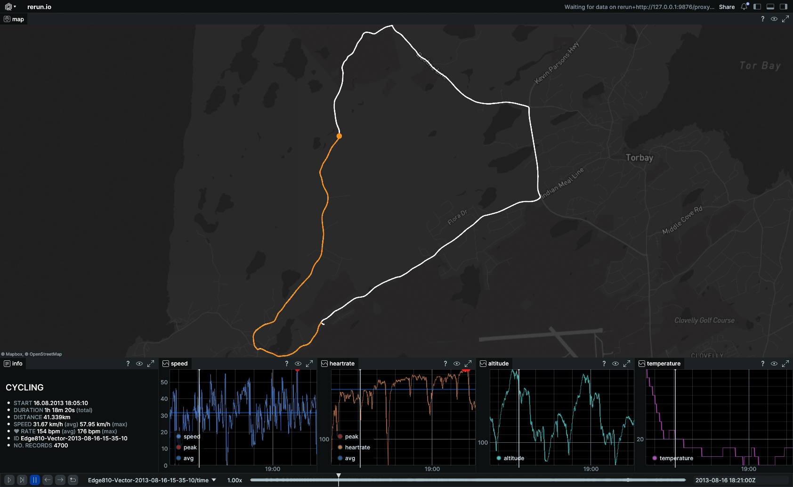

# fit-activities-rerun

Load [`*.fit` file](https://developer.garmin.com/fit/overview/) data and stream it into [Rerun.io](https://rerun.io) for interactive visualization of fitness activities.

**Features:**
- Map views: [Open Street Map](https://www.openstreetmap.org) (default) or [`Mapbox`](https://www.mapbox.com) ([access token](https://docs.mapbox.com/help/glossary/access-token/) needed)
- Charts: `speed`, `heartrate`, `altitude`, `temperature` 
- `Summary` info panel
- Free and open source

# Table of Contents

- [Preview](./#preview)
- [Requirements](./#requirements)
- [CLI](./#cli)
- [License](./#license)

# Preview

<a href="data/fit-activity-rerun-preview.jpg">
  
</a>

# Requirements

## With `Nix` (recommended)

`cd` into root directory. If you have `direnv` installed, run `direnv allow` once to install dependencies. Otherwise run `nix develop`. This will set up `Python`, `uv`, and all system dependencies you need.

## Without `Nix`

- [Python](https://www.python.org) 3.13+
- [uv](https://docs.astral.sh/uv/)

Setup:
```sh
uv venv .venv
source .venv/bin/activate
uv sync
```

# CLI

```sh
usage: fit-activities-rerun [-h] [--fit FIT]
                            [--blueprint {none,vertical}] [--headless]
                            [--connect] [--serve] [--url URL]
                            [--save SAVE] [--stdout]

Visualize `*.fit` data using Rerun

options:
  -h, --help            show this help message and exit
  --fit FIT             Path to the .fit file
  --blueprint {none,vertical}
                        Select the blueprint to use
  --headless            Don't show GUI
  --connect             Connect to an external viewer
  --serve               Serve a web viewer (WARNING: experimental
                        feature)
  --url URL             Connect to this Rerun URL
  --save SAVE           Save data to a .rrd file at this path
  --stdout              Log data to standard output, to be piped into a
                        Rerun Viewer
```

## Usage

```sh
fit-activities-rerun --fit <path-to-fit-file>
```

### Example

```sh
fit-activities-rerun --fit data/fitdecode/Edge810-Vector-2013-08-16-15-35-10.fit
```


## Environment Variables

To enable `Mapbox` in the map view, set `RERUN_MAPBOX_ACCESS_TOKEN` in `.env`:
```sh
RERUN_MAPBOX_ACCESS_TOKEN=your_token
```
See [`.env.example`](./.env.example) for reference.

Or export it directly:
```sh
export RERUN_MAPBOX_ACCESS_TOKEN=your_token
fit-activities-rerun --fit activity.fit
```

# License

[MIT](./LICENSE)
